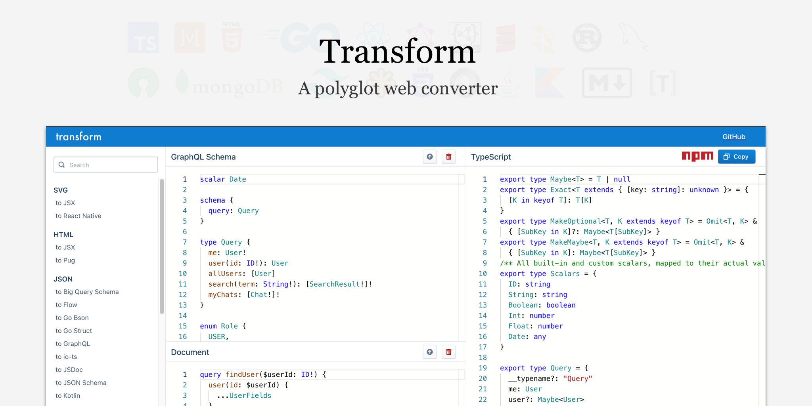

# 无CDN版transform

fork自[https://github.com/ritz078/transform](https://github.com/ritz078/transform)

去除monaco编辑器的cdn，并且语言改成中文

去除cdn的方法是本地cdn，也就是从cdn上下载文件放在 `/public/static`，然后配置cdn路径为自己

## 构建

### 开发环境

必须是 `v16.X`版本的node.js

请到node.js网站下载对应版本，下载二进制文件(zip压缩包)解压后，修改环境变量Path里面的原有nodejs到对应新目录，重启终端后就成功切换到v16.x的版本

### 初始化

国内网络可能会导致某些包安装失败

```sh
yarn
```

### 编译

```sh
yarn build
```

### 发行

```sh
yarn export
```

运行后会有一个 `out`文件夹，里面的内容放到静态http服务器即可

注意发行前必须编译，否则会一直导出以前编译出的老版本
